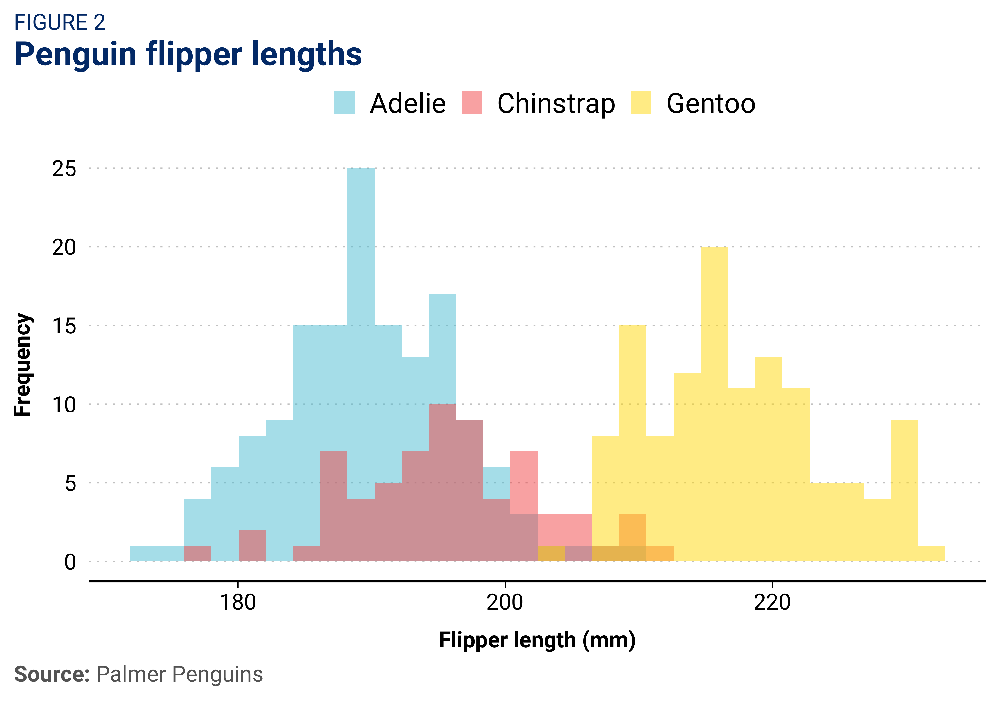
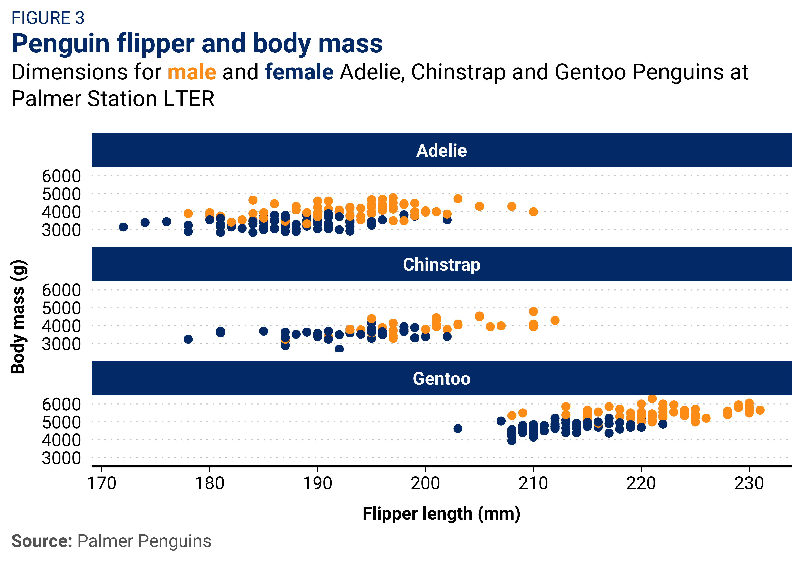
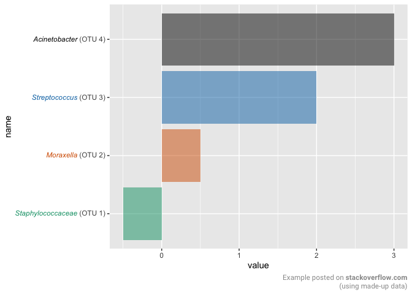
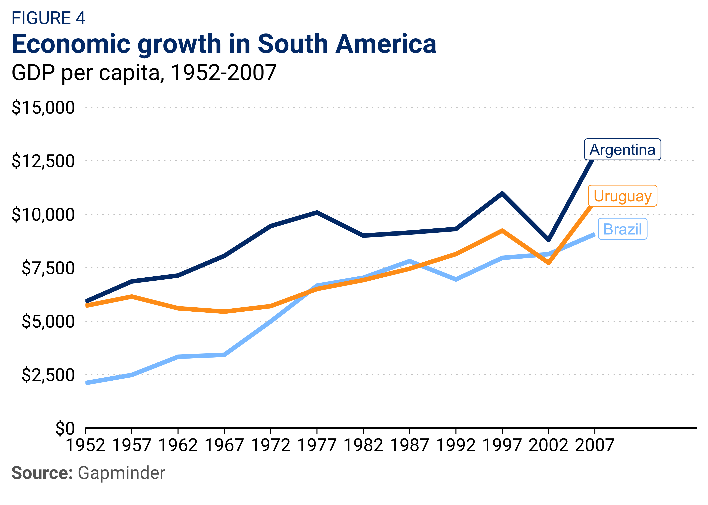

<!-- README.md is generated from README.Rmd. Please edit that file -->

# ggbrookings 

## Overview

`ggbrookings` is a `ggplot2` extension which implements the Brookings
style guide. It offers several color palettes, a custom theme, and a few
helper functions.

## Installation

In order to install packages from GitHub you first need to install
`remotes`.

``` r
install.packages("remotes")
remotes::install_github("BrookingsInstitution/ggbrookings", build_vignettes = TRUE)
```

**Note:** If you are on a Brookings laptop, you may need to change your
timezone for `devtools` to work. This can be done by running:

``` r
Sys.setenv(TZ = 'UTC')
```

## Fonts

**Roboto** is Brooking’s main font. You will need to install it by
visiting [Google
fonts](https://fonts.google.com/specimen/Roboto?query=Roboto) and
clicking “Download family”.

Once you’ve done this, unzip and open each of the .ttf files and click
install. Finaly, run the code chunk below to ensure Roboto is imported
and registered:

``` r
import_roboto()
```

If you run into any problems while installing fonts on a Windows
computer try the following solution from this
[issue](https://github.com/wch/extrafont/issues/88):

``` r
remove.packages("Rttf2pt1")
remotes::install_version("Rttf2pt1", version = "1.3.8") 
```

## Usage

Currently, the `ggbrookings` package only has a few simple user facing
functions:

-   `theme_brookings()` overrides the default `ggplot2` theme for a
    custom one which adheres to the Brookings style guide.

-   `scale_color_brookings()` and `scale_fill_brookings()` provide
    several color palettes that are consistent with the Brookings brand
    and designed to provide color accessiblity.

-   `brookings_view_palette()` is a helper function to see the colors
    from each palette and extract their hex codes.

-   `add_logo()` adds a program/center logo to your plots after saving
    them. See the [vignette on adding
    logos](https://brookingsinstitution.github.io/ggbrookings/articles/logos.html)
    for more details.

## Examples

I highly recommend that you install librarian by running
`install.packages('librarian')` as it lets you quickly install, update,
and attach packages from CRAN, GitHub, and Bioconductor in one function
call.

``` r
# Load the necessary libraries
librarian::shelf(tidyverse, palmerpenguins, ggbrookings)
```

### Scatterplot

In order to match the Brookings style in scatterplots you should set
`geom_point(size = 2)` as below:

``` r
  ggplot(data = penguins,
       aes(x = bill_length_mm,
           y = bill_depth_mm,
           group = species)) +
  geom_point(aes(color = species,
                 shape = species),
             size = 2,
             alpha = 0.8) +
  geom_smooth(method = "lm", se = FALSE, aes(color = species)) +
  theme_brookings() +
  scale_color_brookings(palette = "misc") +
  labs(title = "Penguin bill dimensions",
       subtitle = "Bill length and depth for Adelie, Chinstrap and Gentoo Penguins at Palmer Station LTER",
       caption = '**Source:** Palmer Penguins',
       tag = 'FIGURE 1',
       x = "Bill length (mm)",
       y = "Bill depth (mm)",
       color = "Penguin species",
       shape = "Penguin species") 
```



### Histogram

``` r
  ggplot(data = penguins, aes(x = flipper_length_mm)) +
  geom_histogram(aes(fill = species),
                 alpha = 0.5,
                 position = "identity",
                 bins = 30) +
  scale_fill_brookings(palette = "semantic3") +
  theme_brookings() +
  labs(x = "Flipper length (mm)",
       y = "Frequency",
       title = "Penguin flipper lengths",
       caption = '**Source:** Palmer Penguins',
       tag = 'FIGURE 2') +
    scale_x_continuous(expand = expansion()) +
    scale_y_continuous(expand = expansion())
```



You can change the size of your text proportionally by setting
`theme_brookings(base_size = your_size)` as shown below:

### Faceting

``` r
  ggplot(penguins, aes(x = flipper_length_mm,
                     y = body_mass_g)) +
  geom_point(aes(color = sex),
             size = 2,
             show.legend = FALSE) +
  theme_brookings() +
  scale_color_brookings('brand1', na.translate = FALSE) +
  labs(title = "Penguin flipper and body mass",
       subtitle = "Dimensions for <span style = 'color:#FF9E1B;'>**male**</span> and <span style = 'color:#003A79;'>**female**</span> Adelie, Chinstrap and Gentoo Penguins at Palmer Station LTER",
       caption = '**Source:** Palmer Penguins',
       tag = 'FIGURE 3',
       x = "Flipper length (mm)",
       y = "Body mass (g)",
       color = "Penguin sex") +
  facet_wrap(. ~ species, nrow = 3, ncol = 1) +
        scale_x_continuous(expand = expansion()) +
    scale_y_continuous(expand = expansion())
```



### Line plot

In order to match the Brookings style in line plots you should set
`geom_line(size = 1.5)` as below:

``` r
librarian::shelf(gapminder)

gapminder_filtered <-
  gapminder %>% 
  filter(country %in% c('Argentina', 'Brazil', 'Uruguay'))  

gapminder_filtered %>% 
  ggplot(aes(x = year, gdpPercap, color = country, label = country)) +
  geom_line(size = 1.5) +
  geom_label(data = gapminder_filtered %>% filter(year == last(year)), 
             aes(label = country, 
                 x = year + 3, 
                 y = gdpPercap + 250, 
                 color = country)) +
  theme_brookings(base_size = 16) +
  guides(color = 'none') +
  scale_x_continuous(breaks = seq(1952, 2007, 5),
                     limits  = c(1952, 2012),
                     expand = expansion(mult = c(0, 0.1))) +
  scale_y_continuous(labels = scales::label_dollar(), 
                     limits = c(0, 15000), breaks = seq(0, 15000, 2500),
                     expand = expansion(0)) +
  scale_color_brookings() +
  labs(title = 'Economic growth in South America',
       subtitle = 'GDP per capita, 1952-2007',
       caption = '**Source:** Gapminder',
       tag = 'FIGURE 4',
       x = NULL, 
       y = NULL) 
```


