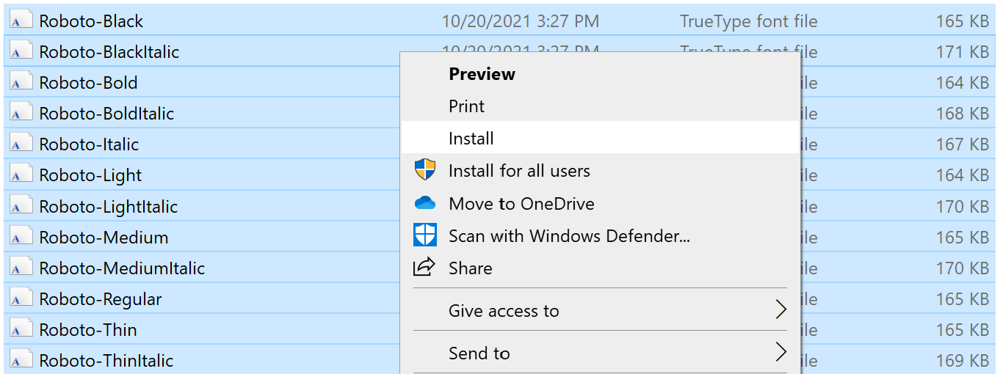

ggbrookings Workaround
================
James Seddon

## Are you a Brookings employee with a company-owned Windows laptop?

If so, the `ggbrookings` package will not work right out of the box due
to Carbon Black. Read on for a workaround solution.

------------------------------------------------------------------------

## Step 0: Is this still an issue?

Check if the following is still necessary by running
`ggbrookings::import_roboto()`. If you get a Carbon Black pop-up, or get
a cryptic error message, it is indeed still an issue.

------------------------------------------------------------------------

## Step 1: Install Roboto again.

First, go to [this link](https://fonts.google.com/specimen/Roboto) and
hit “Download Family” in the top right hand corner. Open the downloaded
file, unzip, and then select all of the .ttf files, and then
right-click. Hit Install (see below). **Do not**
`Install for all users`.



------------------------------------------------------------------------

## Step 2: Locate these files

Navigate to
`C:/Users/[YOUR USERNAME]/AppData/Local/Microsoft/Windows/Fonts/`. Check
that you see all Roboto fonts installed, and then proceed on to the next
step.

------------------------------------------------------------------------

## Step 3: Install and load `showtext`

Run the following commands:

``` r
# Install showtext, a font-handling package
install.packages("showtext")
# load this package
library(showtext)
```

Then, run the following command and verify this is the output you see:

``` r
font_paths()
```

    ## [1] "C:\\Windows\\Fonts"

If you do, proceed on to the next step.

------------------------------------------------------------------------

## Step 4: Adding the font

Unfortunately, you will have to copy and paste this solution into the
top of your document for execution every time you restart R.

Replacing your username in lieu of \[YOUR USERNAME\], removing brackets,
run the following:

``` r
# First, add an additional font path
font_paths("C:/Users/[YOUR USERNAME]/AppData/Local/Microsoft/Windows/Fonts/")
```

Then, run this command to add Roboto to the list of available fonts:

``` r
font_add("roboto", regular = "Roboto-Regular.ttf",
         bold = "Roboto-Bold.ttf",
         italic = "Roboto-Italic.ttf",
         bolditalic = "Roboto-BoldItalic.ttf")
```

------------------------------------------------------------------------

## Step 5: Telling R how to render

The next step depends on whether this is an R script (.R file) or an
RMarkdown script (.Rmd file). Yes, this is annoying. My solution comes
from the creator of the package, and can be found
[here](https://github.com/yixuan/showtext/issues/51).

#### If this is an R script, add this at the top of the document:

``` r
# This tells R what engine to render under (sort of). It's important this is inserted before any graphics rendering.
showtext_auto()
# This corrects sizing issues that occur when rendering.
showtext_opts(dpi = 300)
```

Note that the `showtext_opts()` command will make your plots look
strange when viewing in the plots window in RStudio. Adjusting this
number may make it less weird, but will cause the final output (ggsaves,
etc) to look wrong when saving as a file.

Technically, manually adjusting the dpi in `ggsave` means that you also
need to adjust the dpi above; `ggsave` defaults to 300, hence the value
above.

#### If this is an R Markdown document, do this instead:

The solution is much simpler.

In the r setup chunk where options are set, add the following option
(while making sure to also add the code from Step 4 *after* loading your
libraries):

``` r
knitr::opts_chunk$set(fig.showtext=TRUE)
```

------------------------------------------------------------------------

## Step 6: One More Thing

You should be all set up!

You can now use Roboto in `ggbrookings`, provided that you also set the
following option each time you call `theme_brookings()`:

``` r
# set base_family = "roboto" in your ggplot command
your_plot +
theme_brookings(base_family = "roboto")
```

------------------------------------------------------------------------

While this is annoying, it is a trivially easy workaround after being
set up once. Remember that you will need to run Step 4 and 5 each time
you reopen R, and include Step 6 in your `theme_brookings()` function
call.

For any questions, feel free to email James Seddon at: jseddon at
brookings.edu.
